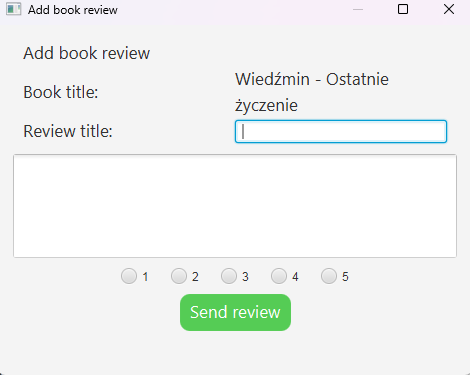

# Library project
#### Mikołaj Maślak, Miłosz Junak, Olgierd Jesionek-Wróblewski

Project created for Object-oriented Technologies course on AGH, written in Spring using Gradle. 
The main objective of the project is to implement an intuitive application 
with the use of modern OOP technologies learnt during lab. exercises.

 

# GUI

The gui contains a vertical nav bar on the left that changes the content visible on the main panel.

The buttons shown in the navbar are dependent on user login status, and his permissions.
For example "ADD BOOK" section is available only for administrators and library workers

---

## Login / register

This starting window allows for logging and registering an account in library.

New accounts have CUSTOMER permissions.

To log in as ADMIN use following:
Email - admin@gmail.com
Password - 1234578

---

## Homepage

The main page of the application, contains a search bar, a list of 5 most recently added books to the library and 
3 books recommended based on user's recent books.

If image couldn't be retrieved from the url the default broken image is shown.

---

## Book Search

This section is used to searching and borrowing books. Book panel is responsive and will change number of books per row depending on window size.

The borrow buttons displays a pop-up window to confirm the borrowing, then if user successfully borrowed the book the available book count will change.

  

The button is disabled if there are no more copies available, user is not logged in or is suspended.

This section also contains advanced search for more filtered and concise view of the library.

Advanced search allows to specify: Title, Author, Language, Genre, Rating

Sorting by columns is also available.

---

## Book Details

If book name on Homepage or Book Search page is pressed the book details view is presented with more detailed book information.

Borrow button shares the same functionality as the button in Book Search view.

Edit Book Data button is only available to people with sufficient permissions such as ADMIN.
After clicking Edit Book Data button a new window shows up:

This window allows the user to modify Book data as required by simply modifying presented values and confirming changes afterward.

If Add Review button is clicked within Book Details view it will open a new window which lets user create appropriate review.

  

---

## User Account

User account view shows user information and a table of all borrowings created by the user.
The table can be sorted by all columns and is scrollable.

If books is not returned yet a return button is shown.

If due date is past current date the row with is highlighted with red color.

## Add Book

Add Book allows authorized users to add new books and authors. 

If form validation fails, an error window explaining the issue is shown.

Author can be selected from the list of all authors in the database, or if new author
 is needed a 'add new author' button can be used.

  

---

## Manage Users

This section which is accessible only to ADMIN and WORKER allows user to modify other users permissions as well as suspend them.

Additionally, there is a functionality to send notifications to every selected user.

A user that is suspended is not allowed to borrow any books from the library, however he still can return them.

---

## Statistics

Statistics section allows user to look into data showcasing which Book Categories and Authors are the highest rated and popular.

--- 

## Notifications

Notifications view contains all the notifications sent to the user.

By clicking a notifications it will show up on the right side of the view.

After seeing the content of the notification the overall number of unread notifications will lower as seen in following picture.

There is also implemented search by Notification name and Hiding already read messages.

---

## Log-out

Simply clicking LOGOUT button in the left navbar will always log out the user and open a Log-in window again.

---
 
 

# Entity classes

# Author

The `Author` class represents an entity in the context of a database table named "authors." It is annotated with `@Entity` to indicate that instances of this class are entities that can be persisted to the database. The corresponding database table name is specified as "authors" using the `@Table` annotation.

### Fields

- **id**: An auto-generated identifier for each author, annotated with `@Id` and configured to use the `GenerationType.IDENTITY` strategy.

- **name**: The name of the author, represented by a `String` field.

- **birthDate**: The birthdate of the author, represented by a `LocalDate` field.

 

# Book

The `Book` class is an entity representing a book in the context of a database table named "books." Similar to the `Author` class, it is annotated with `@Entity` to indicate that instances of this class are entities that can be persisted to the database. The corresponding database table name is specified as "books" using the `@Table` annotation.

## Fields

- **id**: An auto-generated identifier for each book, annotated with `@Id` and configured to use the `GenerationType.IDENTITY` strategy.

- **isbn**: A unique identifier for the book, represented by a `String` field and annotated with `@Column(unique = true)` to ensure uniqueness.

- **title**: The title of the book, represented by a `String` field.

- **authors**: A `List` of authors associated with the book, established through a `@ManyToMany` relationship.

- **category**: The category or genre of the book, represented by an enumerated type (`BookCategory`) and annotated with `@Enumerated(EnumType.STRING)`.

- **pagesCount**: The number of pages in the book, represented by an `int` field.

- **language**: The language in which the book is written, represented by a `Language` enum.

- **description**: The description of book, represented by `String` field.

- **imageUrl**: The URL of image of this book, represented by `String` field.

 

# Borrowing

The `Borrowing` class represents a borrowing a book transaction in the context of a database table named "borrowings."
It is annotated with `@Entity` to indicate that instances of this class are entities that can be persisted to the database. The corresponding database table name is specified as "borrowings" using the `@Table` annotation.

## Fields

- **id**: An auto-generated identifier for each borrowing transaction, annotated with `@Id` and configured to use the `GenerationType.IDENTITY` strategy.

- **user**: The user who is borrowing the book, represented by a `User` entity and mapped through a `@ManyToOne` relationship. The association is defined by the `user_id` foreign key in the "borrowings" table.

- **book**: The book being borrowed, represented by a `Book` entity and mapped through a `@ManyToOne` relationship. The association is defined by the `book_id` foreign key in the "borrowings" table.

- **startDate**: The date when the borrowing transaction starts, represented by a `LocalDate` field.

- **dueDate**: The due date for returning the book, calculated as the `startDate` plus a predefined borrowing duration of 30 days.

- **returnDate**: The date when the book is returned, represented by a `LocalDate` field.

## Constants

- **BORROWING_DURATION**: A constant representing the default borrowing duration, set to a `Duration` of 30 days.

 

# User

The `User` class represents a user entity in the context of a database table named "users." This class implements the `UserDetails` interface, indicating that instances of this class can be used to represent a user for Spring Security.

## Fields

- **id**: An auto-generated identifier for each user, annotated with `@Id` and configured to use the `GenerationType.IDENTITY` strategy.

- **name**: The name of the user, represented by a `String` field.

- **email**: The email address of the user, represented by a `String` field.

- **password**: The password of the user, represented by a `String` field.

- **userRole**: The role of the user, represented by a `UserRole` enum and annotated with `@Enumerated(EnumType.STRING)`.

- **preferences**: User preferences, represented by an embedded `UserPreferences` object.

- **lastLoginDate**: The date of last login of User, represented by `LocalDate` field.

- **registrationDate**: The date of initial registration of the User, represented by `LocalDate` field.

 

# Review

The `Review` class represents a review entity in the context of a database table named "reviews." Instances of this class are used to store reviews written by users for specific books. The class is annotated with `@Entity` to indicate that it is an entity that can be persisted to the database. Additionally, it uses `@IdClass(ReviewId.class)` to specify a composite primary key composed of the `User` and `Book` entities.

## Fields

- **user**: The user who wrote the review, represented by a `User` entity and mapped through a `@ManyToOne` relationship. The association is defined by the `user_id` foreign key in the "reviews" table.

- **book**: The book for which the review is written, represented by a `Book` entity and mapped through a `@ManyToOne` relationship. The association is defined by the `book_id` foreign key in the "reviews" table.

- **title**: The title of the review, represented by a `String` field.

- **reviewText**: The text content of the review, represented by a `String` field.

- **rating**: The numerical rating given in the review, represented by a `short` field.

 

# BookStatistics

The `BookStatistics` class represents statistical information about a book in the context of a database table named "bookStatistics." Instances of this class provide valuable insights into the availability, popularity, and average rating of a book.

## Fields

- **id**: An auto-generated identifier for each book statistics entry, annotated with `@Id` and configured to use the `GenerationType.IDENTITY` strategy.

- **book**: The associated book, represented by a `Book` entity and mapped through a `@OneToOne` relationship. The association is defined by the `book_id` foreign key in the "bookStatistics" table.

- **availableSince**: The date when the book became available, represented by a `LocalDate` field.

- **totalCopies**: The total number of copies of the book.

- **availableCopies**: The number of copies currently available for borrowing.

- **popularity**: A measure of the book's popularity.

- **averageRating**: The average rating given to the book.

 
 

# Enum and embeddable classes

## BookCategory

The `BookCategory` enum represents different genres of books, including Fiction, Romance, Mystery, Science Fiction, Fantasy, Horror, Thriller, Non-Fiction, and Biography, providing a straightforward and organized way to categorize and classify books

 

## Language

The `Language` enum defines language options including Polish, English, and French, offering a clear and concise way to specify and manage language attributes for books.

 

## UserRole

The `UserRole` enum outlines different roles within a system, including Customer, Worker, and Admin, providing a simple and defined structure for managing user roles.

 

## UserPreferences

The `UserPreferences` class is marked as `@Embeddable`, indicating that it is intended to be embedded within another entity. It encapsulates user-specific preferences, such as a preference for a dark theme and the choice to receive emails.

 